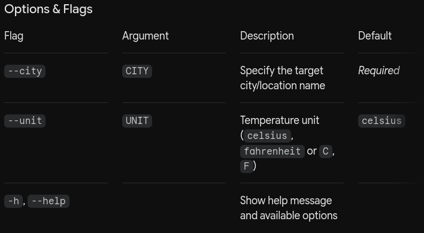

# CLIWeather

> *Turning temperatures into insights.*


[](https://www.python.org/)
[](https://opensource.org/licenses/MIT)

**CLIWeather** is a lightweight, fast, and simple command-line interface (CLI) tool designed to fetch current weather conditions and forecasts directly from your terminal. Whether you need a quick check before heading out, want to plan your upcoming days, or just prefer managing everything without leaving the command line, CLIWeather provides direct and actionable weather data.

---

## Features

- **Quick Weather Lookup:** Fetch real-time weather data for any city worldwide.
- **Unit Flexibility:** Easily switch between Celsius and Fahrenheit.
- **Clean Terminal Output:** Formatted response designed for readability in modern terminals.
- **Minimal Dependencies:** Fast execution and lightweight footprint.

---

## Getting Started

### Prerequisites

- Python 3.8 or higher installed on your machine.
- Git (optional, for cloning the repository).

### Installation & Setup (Local Development)

Currently, the project is run locally via Python. A package manager distribution (e.g., `pip` via PyPI) will be available in future releases.

1. **Clone the repository:**
   ```bash
   git clone https://github.com/hfurtini/cli-weather
   cd CLIWeather
   ```
2. **Create and activate a virtual environment:**
    ```bash
    # Linux / macOS
    python3 -m venv venv
    source venv/bin/activate

    # Windows
    python -m venv venv
    venv\Scripts\activate
    ```
3. **Install dependencies:**
    ```bash
    pip install -r requirements.txt 
    ```

## Usage:
Run the main script using Python:
python main.py [OPTIONS]



### Examples:

Fetch current weather for a city in Celsius:

```bash
python main.py --city "London"
```

Fetch weather in Fahrenheit:

```bash
python main.py --city "New_York" --unit fahrenheit
```

Display help:

```bash
python main.py -h
```

## Contributing

This project is currently maintained as an individual initiative during its MVP phase. It will be opened for public contributions and community participation once core architectural milestones are completed. Stay tuned!

## License

This project is licensed under the MIT License — see the LICENSE file for details.

The software is provided "as is", without warranty of any kind, express or implied.

## Author & Contact

Developed by Henrique Araújo Furtini.

    GitHub: @hfurtini
